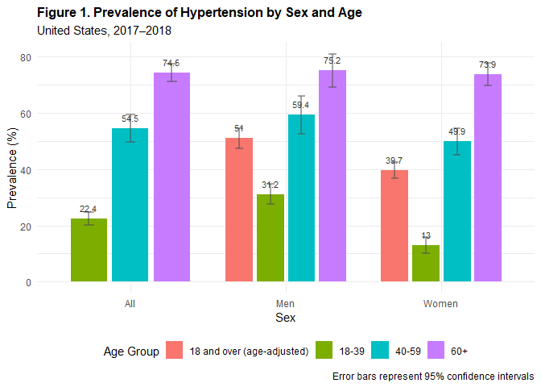
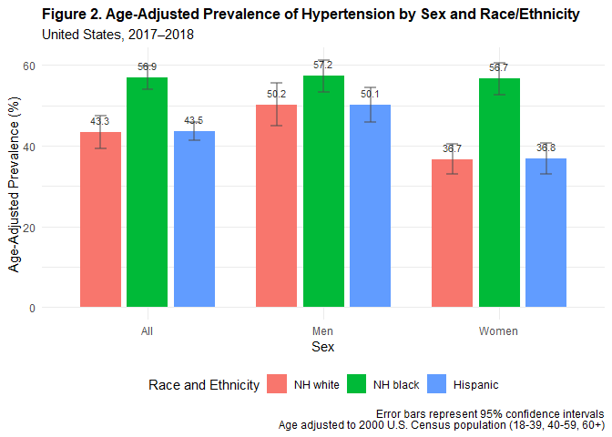
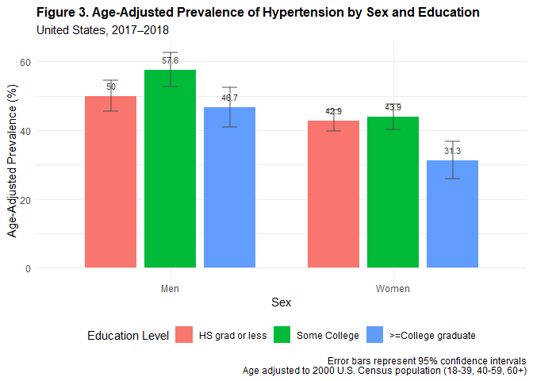
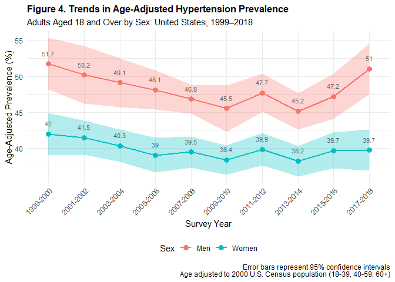

# NHANES_survey_analysis
Allie Warren, allison.warren
2026-02-11

- [Survey Analysis and Converting From SUDAAN to
  R](#survey-analysis-and-converting-from-sudaan-to-r)
  - [Additional Resources](#additional-resources)
  - [Hypertension Prevalence Among Adults Aged 18 and Over: United
    States,
    2017–2018](#hypertension-prevalence-among-adults-aged-18-and-over-united-states-20172018)
    - [Downloading the Data](#downloading-the-data)
    - [Data Formatting](#data-formatting)
    - [Define Survey Design](#define-survey-design)
    - [Figure 1: Hypertension prevalence by sex and
      age](#figure-1-hypertension-prevalence-by-sex-and-age)
    - [Figure 2: Age-Adjusted Prevalence by Sex and
      Race/Ethnicity](#figure-2-age-adjusted-prevalence-by-sex-and-raceethnicity)
    - [Figure 3: Age-Adjusted Prevalence by Sex and
      Education](#figure-3-age-adjusted-prevalence-by-sex-and-education)
    - [Figure 4: Trends in Age-Adjusted Prevalence
      (1999-2018)](#figure-4-trends-in-age-adjusted-prevalence-1999-2018)

# Survey Analysis and Converting From SUDAAN to R

This notebook (mostly) replicates analysis shown in the NCHS Data Brief
is here: <https://www.cdc.gov/nchs/data/databriefs/db364-h.pdf>. SUDAAN
code provided by CDC for running a similar analysis of the NHANES data
is available here:
wwwn.cdc.gov/nchs/data/Tutorials/Code/DB364_SUDAAN.sas.

## Additional Resources

- Survey Data Analysis with R:
  <https://stats.oarc.ucla.edu/r/seminars/survey-data-analysis-with-r/>

- [samplyr](https://github.com/dickoa/samplyr): a tidy grammar for
  survey sampling

``` r
# Load required packages
if(!require("pacman")) install.packages("pacman") #but first we have to install pacman
```

    Loading required package: pacman

``` r
# This load packages for transforming data, reshaping data, analyzing survey data, reading in data stored by SAS, SPSS, Stata, and more, tools for working with functions and vectors, and for creating plots 
pacman::p_load(dplyr, tidyr, survey, foreign, purrr, ggplot2)
```

## Hypertension Prevalence Among Adults Aged 18 and Over: United States, 2017–2018

This analysis looks at hypertension prevalence as reported in the
National Health and Nutrition Examination Survey.

### Downloading the Data

``` r
# Function to download NHANES XPT files
download_nhanes <- function(file_name, cycle_suffix) {
  # get year associated with each suffix
  year_map <- list("B" = "2001",
    "C" = "2003", "D" = "2005", "E" = "2007",
    "F" = "2009", "G" = "2011", "H" = "2013",
    "I" = "2015", "J" = "2017"
  )
  year <- ifelse(cycle_suffix == "", "1999", year_map[[cycle_suffix]])
  separator <- ifelse(cycle_suffix == "", "", "_")
  # CDC NHANES Data url for the current dataset
  url <- paste0("https://wwwn.cdc.gov/Nchs/Data/Nhanes/Public/", 
                year, "/DataFiles/", file_name, separator, cycle_suffix, ".XPT")
  # creates a temporary file path and download file to the temporary location
  tf <- tempfile()
  download.file(url, tf, mode = "wb", quiet = TRUE)
  # read SAS transport file
  data <- foreign::read.xport(tf)
  # delete temporary file
  unlink(tf)
  return(data)
}
```

``` r
# Download all datasets (1999-2018, 10 2 year cycles)
cycles <- c("", "B", "C", "D", "E", "F", "G", "H", "I", "J")

# Download demographic files
demo_list <- lapply(cycles, function(x) {
  download_nhanes("DEMO", x)
})

# Download blood pressure questionnaire files
bpq_list <- lapply(cycles, function(x) {
  download_nhanes("BPQ", x)
})

# Download blood pressure examination files
bpx_list <- lapply(cycles, function(x) {
  download_nhanes("BPX", x)
})
```

### Data Formatting

#### Combine Data

This combines data across the different survey years/cycles and combines
the data from the different survey files.

``` r
# Combine datasets across time periods

# Combine demographic data
demo <- bind_rows(demo_list)

# Combine BPQ data (keep only key variables)
bpq <- bind_rows(bpq_list) %>%
  select(SEQN, BPQ020, BPQ050A, matches("BPQ100D"))

# Combine BPX data (keep only key variables)
bpx <- bind_rows(bpx_list) |> 
  select(SEQN, matches("BPXSY[1-4]"), matches("BPXDI[1-4]"))

# Merge datasets 
hyper_9918 <- demo |> 
  left_join(bpq |> select(SEQN, BPQ020, BPQ050A, BPQ100D), join_by(SEQN)) |> 
  left_join(bpx |>  select(SEQN, starts_with("BPXSY"), starts_with("BPXDI")), join_by(SEQN))

print(head(hyper_9918[,1:10]))
```

      SEQN SDDSRVYR RIDSTATR RIDEXMON RIAGENDR RIDAGEYR RIDAGEMN RIDAGEEX RIDRETH1
    1    1        1        2        2        2        2       29       31        4
    2    2        1        2        2        1       77      926      926        3
    3    3        1        2        1        2       10      125      126        3
    4    4        1        2        2        1        1       22       23        4
    5    5        1        2        2        1       49      597      597        3
    6    6        1        2        2        2       19      230      230        5
      RIDRETH2
    1        2
    2        1
    3        1
    4        2
    5        1
    6        4

#### Create Analysis Variables

``` r
# create analysis variables
hyper_9918 <- hyper_9918 |>  
  # create age category variable 1
  mutate(
    age = case_when(
      RIDAGEYR >= 20 & RIDAGEYR < 40 ~ 1,
      RIDAGEYR >= 40 & RIDAGEYR < 60 ~ 2,
      RIDAGEYR >= 60 ~ 3),
    # Create age category variable
    agecat = case_when(
      RIDAGEYR >= 18 & RIDAGEYR < 40 ~ 1,
      RIDAGEYR >= 40 & RIDAGEYR < 60 ~ 2,
      RIDAGEYR >= 60 ~ 3),
    # Create labeled age category
    agecat_label = factor(agecat,
                          levels = 1:3,
                          labels = c("18-39", "40-59", "60+")),
    
    # Race and Ethnicity combined variable (RIDRETH3 variables starts with 2011-2012 cycle)
    race_et4 = case_when(
      RIDRETH3 == 3 ~ 1,  # NH white
      RIDRETH3 == 4 ~ 2,  # NH black
      RIDRETH3 == 6 ~ 3,  # NH Asian
      RIDRETH3 %in% c(1, 2) ~ 4,  # Hispanic
      RIDRETH3 == 7 ~ 5,  # Other
      TRUE ~ NA_real_), # NA
    # labeled race/ethnicity variable
    race_et4_label = factor(race_et4,
                            levels = 1:5,
                            labels = c("NH white", "NH black", "NH Asian", 
                                       "Hispanic", "Other")),
    # Income (poverty-income ratio)
    FPL = case_when(
      INDFMPIR > 0.00 & INDFMPIR <= 1.30 ~ 1,
      INDFMPIR > 1.30 & INDFMPIR <= 3.50 ~ 2,
      INDFMPIR > 3.50 ~ 3,
      TRUE ~ NA_real_),
    # Labeled income variable
    FPL_label = factor(FPL,
                       levels = 1:3,
                       labels = c("<=130", "130-350", ">350")),
    # Education (handling both adult and youth education variables)
    EDUC = case_when(
      # For ages 18-19, use DMDEDUC3
      RIDAGEYR %in% c(18, 19) & 
        ((DMDEDUC3 >= 0 & DMDEDUC3 < 15) | DMDEDUC3 %in% c(55, 66)) ~ 1, # HS diploma or less
      RIDAGEYR %in% c(18, 19) & DMDEDUC3 == 15 ~ 2, # Some college
      # For ages 20+, use DMDEDUC2
      DMDEDUC2 %in% c(1, 2, 3) ~ 1,  # HS diploma or less
      DMDEDUC2 == 4 ~ 2,              # Some college
      DMDEDUC2 == 5 ~ 3,              # College graduate
      TRUE ~ NA_real_),
    # labeled education variable
    EDUC_label = factor(EDUC,
                        levels = 1:3,
                        labels = c("HS grad or less", "Some College", 
                                   ">=College graduate")),
    # Sex
    sex_label = factor(RIAGENDR,
                       levels = 1:2,
                       labels = c("Men", "Women")),
    # Survey cycle - time span
    sddsrvyr_label = factor(SDDSRVYR,
                            levels = 1:10,
                            labels = c("1999-2000", "2001-2002", "2003-2004",
                                       "2005-2006", "2007-2008", "2009-2010",
                                       "2011-2012", "2013-2014", "2015-2016",
                                       "2017-2018")),
    # Count number of non-missing SBP and DBP readings
    n_sbp = rowSums(!is.na(pick(BPXSY1:BPXSY4))),
    n_dbp = rowSums(!is.na(pick(BPXDI1:BPXDI4))))

# calculate additional variables
hyper_9918 <- hyper_9918 |>
  # Set DBP values of 0 to missing for calculating the average
  #mutate(across(matches("BPXDI[1-4]"), ~ifelse(. == 0, NA, .))) %>%
  mutate(
    # Calculate mean SBP and DBP
    mean_sbp = rowMeans(pick(BPXSY1:BPXSY4), na.rm = TRUE),
    mean_dbp = rowMeans(pick(BPXDI1:BPXDI4), na.rm = TRUE),
    # Hypertension using NEW definition (130/80)
    Hyper_new = case_when(
      (mean_sbp >= 130 | mean_dbp >= 80 | BPQ050A == 1) ~ 1,
      (n_sbp > 0 & n_dbp > 0) ~ 0,
      TRUE ~ NA_real_),
    # Controlled hypertension (NEW definition)
    Controlled = case_when(
      Hyper_new == 1 & (mean_sbp >= 130 | mean_dbp >= 80) ~ 0,
      Hyper_new == 1 & n_sbp > 0 & n_dbp > 0 ~ 1,
      TRUE ~ NA_real_),
    # Hypertension using OLD definition (140/90)
    Hyper_old = case_when(
      (mean_sbp >= 140 | mean_dbp >= 90 | BPQ050A == 1) ~ 1,
      (n_sbp > 0 & n_dbp > 0) ~ 0,
      TRUE ~ NA_real_),
    # Controlled hypertension (OLD definition)
    Controlold = case_when(
      Hyper_old == 1 & (mean_sbp >= 140 | mean_dbp >= 90) ~ 0,
      Hyper_old == 1 & n_sbp > 0 & n_dbp > 0 ~ 1,
      TRUE ~ NA_real_),
    # Awareness of hypertension
    aware = case_when(
      BPQ020 == 1 ~ 1,
      BPQ020 == 2 ~ 0,
      TRUE ~ NA_real_),
    # convert NAs to 0 - important for later filtering step
    RIDEXPRG_cleaned = ifelse(is.na(RIDEXPRG), 0, RIDEXPRG),
    # Subpopulation indicator
    sel1 = ifelse(RIDAGEYR >= 18 & RIDEXPRG_cleaned != 1 & (n_sbp != 0 | n_dbp != 0), 1, 0),
    # Overall indicator
    one = 1
  )
```

#### Subset Data

``` r
# Subset to 2017-2018 data for Figures 1-3
hyper_1718 <- hyper_9918 |> 
  filter(SDDSRVYR == 10)

cat("All Data for 2017-2018:", nrow(hyper_1718), "\n")
```

    All Data for 2017-2018: 9254 

``` r
# subpopulation = 18+, men and non-pregnant women, and individuals who have at least one BP reading (either have a systolic or diastolic blood pressure reading)
cat("Analysis population:", sum(hyper_1718$sel1 == 1, na.rm = TRUE), "\n\n")
```

    Analysis population: 5199 

### Define Survey Design

``` r
# Create survey design for all years (1999-2018)
# strata are defined based on geographic region, metropolitan status (urban/rural), demographic characteristics
# PSUs nested within strata accounts for the design effects
nhanes_9918_design <- svydesign(
  id = ~SDMVPSU, # Primary Sampling Unit (PSU) identifier - geographic areas
  strata = ~SDMVSTRA, # stratfication variable - used to ensure geographic and demoraphic representation
  weights = ~WTMEC2YR, # survey sample weights, accounts for the unequal probability of sampling and non-response - this weight is used for analyzing a single 2 year cycle
  nest = TRUE, # indicates that PSUs are nested w/in strata, not across the netire dataset
  data = hyper_9918
)

# Subset to analysis population
nhanes_9918_analysis <- subset(
  nhanes_9918_design,
  sel1 == 1
)

# Create survey design for 2017-2018
nhanes_1718_design <- svydesign(
  id = ~SDMVPSU, # Primary Sampling Unit (PSU) identifier
  strata = ~SDMVSTRA, # stratafication variable 
  weights = ~WTMEC2YR, # survey sample weights
  nest = TRUE, # indicates that PSUs are nested w/in strata, not across the netire dataset
  data = hyper_1718
)

# Subset to analysis population 
nhanes_1718_analysis <- subset(
  nhanes_1718_design, 
  sel1 == 1,
)
```

#### Calculating Age-Adjusted Prevalence

We can use ‘svystandardize’ to perform direct age standardization by
adjusting the survey weights so that the age distribution of your sample
matches a specified standard/reference population (such as the 2000
Census).

``` r
# Define the standard population
# Age-adjustment weights from year 2000 Census population
# Age groups: 18-39, 40-59, 60+
standard_pop <- data.frame(
  agecat = 1:3,
  Freq = c(0.4203, 0.3572, 0.2225)
)

# Standardize the survey design for the 2017-2018 data - adjusting to the 2000 population
design_std <- svystandardize(
  design = nhanes_1718_analysis,
  by = ~agecat,
  over = ~sex_label,  # Calculate separately for each sex (use ~1 for the whole population)
  population = standard_pop,
  excluding.missing = ~agecat 
)
```

### Figure 1: Hypertension prevalence by sex and age

``` r
# Age-specific prevalence overall
fig1_age_specific_overall <- svyby(
  formula = ~Hyper_new,
  by = ~agecat_label,
  design = nhanes_1718_analysis,
  FUN = svymean,
  na.rm = TRUE,
  vartype = c("se", "ci")) |> 
  mutate(sex_label = 'All',
    prevalence = Hyper_new * 100,
    se = se * 100,
    ci_l = ci_l * 100,
    ci_u = ci_u * 100) |> 
  select(sex_label, agecat_label, prevalence, se, ci_l, ci_u)

# Age-specific prevalence by sex
age_specific <- svyby(
  formula = ~Hyper_new,
  by = ~sex_label + agecat_label,
  design = nhanes_1718_analysis,
  FUN = svymean,
  na.rm = TRUE,
  vartype = c("se", "ci")) 

fig1_age_specific <- age_specific |> 
  mutate(
    prevalence = Hyper_new * 100,
    se = se * 100,
    ci_l = ci_l * 100,
    ci_u = ci_u * 100) |> 
  select(sex_label, agecat_label, prevalence, se, ci_l, ci_u)

# Age-adjusted prevalence by sex for 18+
age_adjusted_prev <- svyby(
  formula = ~Hyper_new,
  by = ~sex_label,
  design = design_std, # use survey design defined with the weights
  FUN = svymean,
  # method = 'beta', can also specify different approaches here, default is logit
  na.rm = TRUE,
  vartype = c("se", "ci"))

fig1_age_adjusted <- age_adjusted_prev |> 
  mutate(prevalence = Hyper_new * 100,
         se = se * 100,
         ci_l = ci_l * 100,
         ci_u = ci_u * 100,
    agecat_label = "18 and over (age-adjusted)") |> 
  select(sex_label, agecat_label, prevalence, se, ci_l, ci_u)

# Combine age-specific and age-adjusted
fig1_results <- bind_rows(fig1_age_specific_overall, fig1_age_specific, fig1_age_adjusted) |> 
  arrange(sex_label, agecat_label) |> 
  mutate(agecat_label = factor(agecat_label, levels =  c('18 and over (age-adjusted)', '18-39', '40-59', '60+')))

# Plot Figure 1
ggplot(fig1_results, aes(x = sex_label, y = prevalence, 
                              fill = agecat_label, group = agecat_label)) +
  # column plot w/ side by side bars for each category
  geom_col(position = position_dodge(width = 0.8), width = 0.7) +
  # add error bars
  geom_errorbar(aes(ymin = ci_l, ymax = ci_u),
                position = position_dodge(width = 0.8),
                width = 0.2, linewidth = 0.8, alpha = .5, color = 'gray30') +
  # add text label above the bar
  geom_text(aes(label = round(prevalence, 1)),
            position = position_dodge(width = 0.8),
            vjust = -1, size = 3, alpha = .8) +
  # adjust axis labels, title, and caption
  labs(title = "Figure 1. Prevalence of Hypertension by Sex and Age",
    subtitle = "United States, 2017–2018",
    fill = "Age Group",
    y = "Prevalence (%)",
    x = "Sex",
    caption = "Error bars represent 95% confidence intervals") +
  # set theme to minimal
  theme_minimal() +
  # move legend to bottom and bold title
  theme(plot.title = element_text(face = "bold", size = 12),
    legend.position = "bottom")
```



``` r
print(fig1_results)
```

                sex_label               agecat_label prevalence       se     ci_l
    18-39             All                      18-39   22.37653 1.176136 20.07134
    40-59             All                      40-59   54.50647 2.460317 49.68434
    60+               All                        60+   74.47679 1.601812 71.33729
    Men               Men 18 and over (age-adjusted)   51.04410 1.783849 47.54782
    Men.18-39         Men                      18-39   31.17370 1.774532 27.69568
    Men.40-59         Men                      40-59   59.37466 3.427711 52.65646
    Men.60+           Men                        60+   75.20524 3.010938 69.30391
    Women           Women 18 and over (age-adjusted)   39.70996 1.456068 36.85612
    Women.18-39     Women                      18-39   13.01185 1.424718 10.21945
    Women.40-59     Women                      40-59   49.85595 2.389642 45.17234
    Women.60+       Women                        60+   73.85408 2.038212 69.85926
                    ci_u
    18-39       24.68171
    40-59       59.32861
    60+         77.61628
    Men         54.54038
    Men.18-39   34.65172
    Men.40-59   66.09285
    Men.60+     81.10657
    Women       42.56380
    Women.18-39 15.80424
    Women.40-59 54.53956
    Women.60+   77.84891

#### Comparison of Prevalence Between Men and Women

``` r
# Test for difference between men and women (age-adjusted, 2017-2018)
# Computes lienar or nonlinear contrasts of survey statistics - used for proportions/prevalence
overall_contrast_result <- svycontrast(age_adjusted_prev,
  contrasts = list("Men - Women" = c(1, -1)))
```

    Warning in vcov.svyby(stat): Only diagonal elements of vcov() available

``` r
print(overall_contrast_result)
```

                contrast    SE
    Men - Women  0.11334 0.023

``` r
print(confint(overall_contrast_result))
```

                     2.5 %    97.5 %
    Men - Women 0.06821007 0.1584728

``` r
# Can also compute for just a specific age category
contrast_18_39 <- svycontrast(
  age_specific,
  contrasts = list(
    "18-39: Men - Women" = c(1, -1, 0, 0, 0, 0)))
```

    Warning in vcov.svyby(stat): Only diagonal elements of vcov() available

``` r
print(contrast_18_39)
```

                       contrast     SE
    18-39: Men - Women  0.18162 0.0228

### Figure 2: Age-Adjusted Prevalence by Sex and Race/Ethnicity

``` r
# Calculate age-adjusted prevalence by sex and race
design_std_fig2 <- svystandardize(
  design = nhanes_1718_analysis,
  by = ~agecat,                              # Standardize by age
  over = ~sex_label + race_et4_label,        # Keep sex and race/eth separate
  population = standard_pop,
  excluding.missing = ~agecat)

# Calculate age-adjusted prevalence by race
fig2_overall_results <- svyby(
  formula = ~Hyper_new,
  by = ~race_et4_label,
  design = design_std_fig2,
  FUN = svymean,
  na.rm = TRUE,
  vartype = c("se", "ci")) |> 
  mutate(sex_label = 'All',
         prevalence = Hyper_new * 100,
         se = se * 100,
         ci_l = ci_l * 100,
         ci_u = ci_u * 100) |> 
  # Plotting NH white, NH black, and Hispanic (as in the data brief)
  filter(race_et4_label %in% c("NH white", "NH black", "Hispanic")) |> 
  select(sex_label, race_et4_label, prevalence, se, ci_l, ci_u)


# Calculate age-adjusted prevalence by sex and race
fig2_age_adj_results <- svyby(
  formula = ~Hyper_new,
  by = ~sex_label+race_et4_label,
  design = design_std_fig2,
  FUN = svymean,
  na.rm = TRUE,
  vartype = c("se", "ci")) |> 
  mutate(prevalence = Hyper_new * 100,
         se = se * 100,
         ci_l = ci_l * 100,
         ci_u = ci_u * 100) |> 
  # Plotting NH white, NH black, and Hispanic (as in the data brief)
  filter(race_et4_label %in% c("NH white", "NH black", "Hispanic")) |> 
  select(sex_label, race_et4_label, prevalence, se, ci_l, ci_u)

# combine results for prev by sex and race, and by just race
fig2_results <- rbind(fig2_overall_results, fig2_age_adj_results)

# Plot Figure 2
ggplot(fig2_results, aes(x = sex_label, y = prevalence, 
                         fill = race_et4_label)) +
  geom_col(position = position_dodge(width = 0.8), width = 0.7) +
  geom_errorbar(aes(ymin = ci_l, ymax = ci_u),
                position = position_dodge(width = 0.8),
                width = 0.2, linewidth = 0.8, alpha = .5, color = 'grey30') +
  geom_text(aes(label = round(prevalence, 1)),
            position = position_dodge(width = 0.8),
            vjust = -1, size = 3, alpha = .8) +
  labs(title = "Figure 2. Age-Adjusted Prevalence of Hypertension by Sex and Race/Ethnicity",
    subtitle = "United States, 2017–2018",
    fill = "Race and Ethnicity",
    y = "Age-Adjusted Prevalence (%)",
    x = "Sex",
    caption = "Error bars represent 95% confidence intervals\nAge adjusted to 2000 U.S. Census population (18-39, 40-59, 60+)") +
  theme_minimal() +
  theme(plot.title = element_text(face = "bold", size = 12),
    axis.text.x = element_text(angle = 0, hjust = 0.5),
    legend.position = "bottom")
```



``` r
print(fig2_results)
```

                   sex_label race_et4_label prevalence       se     ci_l     ci_u
    NH white             All       NH white   43.33570 2.055352 39.30728 47.36412
    NH black             All       NH black   56.92788 1.532475 53.92428 59.93147
    Hispanic             All       Hispanic   43.53557 1.138804 41.30355 45.76758
    Men.NH white         Men       NH white   50.23058 2.697725 44.94313 55.51802
    Women.NH white     Women       NH white   36.68168 1.928589 32.90172 40.46165
    Men.NH black         Men       NH black   57.24921 2.016399 53.29714 61.20128
    Women.NH black     Women       NH black   56.65825 2.021872 52.69546 60.62105
    Men.Hispanic         Men       Hispanic   50.14196 2.184916 45.85960 54.42431
    Women.Hispanic     Women       Hispanic   36.81146 1.955394 32.97896 40.64396

### Figure 3: Age-Adjusted Prevalence by Sex and Education

``` r
# Calculate age-adjusted prevalence by sex and education
design_std_fig3 <- svystandardize(
  design = nhanes_1718_analysis,
  by = ~agecat,                              # Standardize by age
  over = ~sex_label + EDUC_label,        # Keep sex and education separate
  population = standard_pop,
  excluding.missing = ~agecat+EDUC_label) # ignore data with missing age or education

# Calculate age-adjusted prevalence
fig3_age_adj_results <- svyby(
  formula = ~Hyper_new,
  by = ~sex_label+EDUC_label,
  design = design_std_fig3,
  FUN = svymean,
  na.rm = TRUE,
  vartype = c("se", "ci")) |> 
  mutate(prevalence = Hyper_new * 100,
         se = se * 100,
         ci_l = ci_l * 100,
         ci_u = ci_u * 100)

# Plot Figure 3
ggplot(fig3_age_adj_results, aes(x = sex_label, y = prevalence, 
                         fill = EDUC_label)) +
  geom_col(position = position_dodge(width = 0.8), width = 0.7) +
  geom_errorbar(aes(ymin = ci_l, ymax = ci_u),
                position = position_dodge(width = 0.8),
                width = 0.2, linewidth = 0.8, alpha = .5, color ='grey30') +
  geom_text(aes(label = round(prevalence, 1)),
            position = position_dodge(width = 0.8),
            vjust = -1, size = 3, alpha = .8) +
  labs(title = "Figure 3. Age-Adjusted Prevalence of Hypertension by Sex and Education",
    subtitle = "United States, 2017–2018",
    fill = "Education Level",
    y = "Age-Adjusted Prevalence (%)",
    x = "Sex",
    caption = "Error bars represent 95% confidence intervals\nAge adjusted to 2000 U.S. Census population (18-39, 40-59, 60+)") +
  theme_minimal() +
  theme(plot.title = element_text(face = "bold", size = 12),
    legend.position = "bottom")
```



``` r
print(fig3_age_adj_results)
```

                             sex_label         EDUC_label Hyper_new       se
    Men.HS grad or less            Men    HS grad or less 0.5001886 2.273663
    Women.HS grad or less        Women    HS grad or less 0.4286689 1.608150
    Men.Some College               Men       Some College 0.5761104 2.563311
    Women.Some College           Women       Some College 0.4389264 1.900482
    Men.>=College graduate         Men >=College graduate 0.4667552 2.979046
    Women.>=College graduate     Women >=College graduate 0.3130602 2.781255
                                 ci_l     ci_u prevalence
    Men.HS grad or less      45.56256 54.47515   50.01886
    Women.HS grad or less    39.71497 46.01880   42.86689
    Men.Some College         52.58704 62.63503   57.61104
    Women.Some College       40.16776 47.61751   43.89264
    Men.>=College graduate   40.83670 52.51434   46.67552
    Women.>=College graduate 25.85486 36.75718   31.30602

### Figure 4: Trends in Age-Adjusted Prevalence (1999-2018)

``` r
# Calculate age-adjusted prevalence by sex and education
design_std_fig4 <- svystandardize(
  design = nhanes_9918_analysis,
  by = ~agecat,                              # Standardize by age
  over = ~sex_label + sddsrvyr_label,        # Keep sex and cycle separate
  population = standard_pop,
  excluding.missing = ~agecat+sddsrvyr_label) # ignore data w/ missing age or year 

# Calculate age-adjusted prevalence
time_age_adj_prev <- svyby(
  formula = ~Hyper_new,
  by = ~sex_label+sddsrvyr_label,
  design = design_std_fig4,
  FUN = svymean,
  na.rm = TRUE,
  vartype = c("se", "ci"))

fig4_age_adj_results <- time_age_adj_prev |> 
  mutate(prevalence = Hyper_new * 100,
         se = se * 100,
         ci_l = ci_l * 100,
         ci_u = ci_u * 100)


# Plot Figure 4
ggplot(fig4_age_adj_results, aes(x = sddsrvyr_label, y = prevalence, group = sex_label)) +
  geom_point(size = 3, aes(color = sex_label)) +
  geom_line(linewidth = 1, aes(color = sex_label)) +
  # add confidence interval using a shaded ribbon
  geom_ribbon(aes(ymin = ci_l, ymax = ci_u, fill = sex_label),
              alpha = .3) +
  # add text label for each value
  geom_text(aes(label = round(prevalence, 1)),
            vjust = -1.5, size = 3, alpha = .6) +
  # adjust labels
  labs(title = "Figure 4. Trends in Age-Adjusted Hypertension Prevalence",
    subtitle = "Adults Aged 18 and Over by Sex: United States, 1999–2018",
    x = "Survey Year",
    y = "Age-Adjusted Prevalence (%)",
    color = "Sex",
    caption = "Error bars represent 95% confidence intervals\nAge adjusted to 2000 U.S. Census population (18-39, 40-59, 60+)") +
  # remove legend for fill
  guides(fill = 'none') +
  # set theme and adjust legend and text labels
  theme_minimal() +
  theme(plot.title = element_text(face = "bold", size = 12),
    axis.text.x = element_text(angle = 45, hjust = 1),
    legend.position = "bottom")
```



``` r
print(fig4_age_adj_results)
```

                    sex_label sddsrvyr_label Hyper_new       se     ci_l     ci_u
    Men.1999-2000         Men      1999-2000 0.5173670 1.841408 48.12760 55.34579
    Women.1999-2000     Women      1999-2000 0.4196501 1.495900 39.03310 44.89692
    Men.2001-2002         Men      2001-2002 0.5018154 2.047185 46.16913 54.19395
    Women.2001-2002     Women      2001-2002 0.4147015 1.222198 39.07469 43.86561
    Men.2003-2004         Men      2003-2004 0.4912581 1.726948 45.74106 52.51057
    Women.2003-2004     Women      2003-2004 0.4034489 1.155708 38.07974 42.61004
    Men.2005-2006         Men      2005-2006 0.4811192 1.409676 45.34900 50.87483
    Women.2005-2006     Women      2005-2006 0.3904125 1.232088 36.62640 41.45610
    Men.2007-2008         Men      2007-2008 0.4681631 1.029237 44.79904 48.83358
    Women.2007-2008     Women      2007-2008 0.3945516 1.106462 37.28654 41.62379
    Men.2009-2010         Men      2009-2010 0.4552595 1.656375 42.27952 48.77239
    Women.2009-2010     Women      2009-2010 0.3836580 1.038140 36.33108 40.40051
    Men.2011-2012         Men      2011-2012 0.4771264 1.345811 45.07490 50.35038
    Women.2011-2012     Women      2011-2012 0.3985140 1.147908 37.60154 42.10126
    Men.2013-2014         Men      2013-2014 0.4515868 1.299741 42.61123 47.70612
    Women.2013-2014     Women      2013-2014 0.3819773 1.093498 36.05451 40.34094
    Men.2015-2016         Men      2015-2016 0.4722018 1.612663 44.05942 50.38094
    Women.2015-2016     Women      2015-2016 0.3969475 1.266513 37.21243 42.17707
    Men.2017-2018         Men      2017-2018 0.5104410 1.783849 47.54782 54.54038
    Women.2017-2018     Women      2017-2018 0.3970996 1.456068 36.85612 42.56380
                    prevalence
    Men.1999-2000     51.73670
    Women.1999-2000   41.96501
    Men.2001-2002     50.18154
    Women.2001-2002   41.47015
    Men.2003-2004     49.12581
    Women.2003-2004   40.34489
    Men.2005-2006     48.11192
    Women.2005-2006   39.04125
    Men.2007-2008     46.81631
    Women.2007-2008   39.45516
    Men.2009-2010     45.52595
    Women.2009-2010   38.36580
    Men.2011-2012     47.71264
    Women.2011-2012   39.85140
    Men.2013-2014     45.15868
    Women.2013-2014   38.19773
    Men.2015-2016     47.22018
    Women.2015-2016   39.69475
    Men.2017-2018     51.04410
    Women.2017-2018   39.70996
