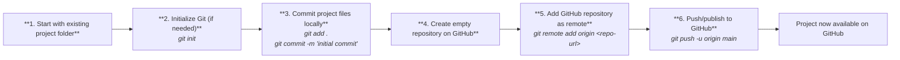
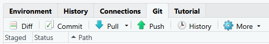
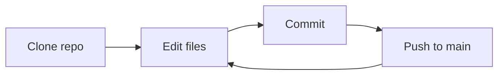

# Prerequisites

## Install

You must have:

-   Git SCM installed. See <https://git-scm.com/install/windows>
-   RStudio installed. See <https://posit.co/download/rstudio-desktop/>

## Configuration

### Get Set Up

Install `usethis` R package

```{r}
install.packages("usethis")
```

Check out `?usethis::git_vaccinate`

```{r}
?usethis::git_vaccinate
```

"Vaccinate" yourself with `usethis::git_vaccinate()`; sets global `.gitignore` for all git use
    
```{r}
usethis::git_vaccinate()
```
    
Consider changing your default terminal to `BASH` if you use linux-style shell or git CLI often:

-   `Tools` → `Global Options...`
- In `Global Options...` → find and click `Terminal` on the left side panel
- In `New Terminal Opens With...` setting → Select `Git BASH`
        
### Configure your Git credentials

::: callout-tip
If using GitHub Desktop app, your git config can be set in `File` →
`Settings` → `Git`
:::

::: callout-caution
Git configuration email must **match** the email you registered to your GitHub account.
:::

Open your terminal in RStudio.

``` bash
git config --global user.name "Your Name"
git config --global user.email "your_email@example.com"
```

Check with:

``` bash
git config user.name
git config user.email
```

Or open it directly

``` bash
git config --global --edit
```

## GitHub authentication

There are three common ways to authenticate with GitHub when using Git
and RStudio.

::: callout-note
### Recommended Default!

For most users, use **HTTPS with Credential Manager**.

-   Use **SSH** if you prefer a key-based setup with fewer prompts
-   Use **PATs** when working with GitHub from R packages or automation
:::

<br>

### 1. HTTPS (Credential Manager)

-   Uses HTTPS remotes (`https://github.com/...`)
-   Authentication is handled by your system’s credential manager (e.g.,
    Git Credential Manager)
-   May open a browser sign-in on first use (e.g. cloning a GitHub repo as R project)
-   Credentials are stored securely and reused

**Best for:** - Most users\
- Interactive RStudio workflows\
- Minimal setup

------------------------------------------------------------------------

<br>

### 2. Personal Access Token (PAT)

-   A token used instead of a password over HTTPS
-   Stored in a credential manager or environment variables (e.g.,
    `.Renviron`)
-   Commonly used by R packages that interact with GitHub (e.g.,
    `usethis`)

**Best for:** - GitHub API usage from R\
- Automation and scripting\
- Environments without credential manager support

See: https://happygitwithr.com/https-pat#https-pat

------------------------------------------------------------------------

<br>

### 3. SSH (Secure Shell)

-   Uses SSH remotes (`git@github.com:...`)
-   Authentication via public/private key pair
-   No browser prompts or tokens required

**Best for:** - Technical users\
- Long-term, low-friction Git usage\
- Stable development environments

See: https://happygitwithr.com/ssh-keys#ssh-keys

------------------------------------------------------------------------

<br><br>

# GitHub Flow



<br><br>

# Start on GitHub ↔ Start locally

## GitHub-first workflow

This is the easiest default for most people, especially beginners.

**Typical sequence:**

1.  Create repository on GitHub
2.  In RStudio: *New Project → Version Control → Git → paste URL*
3.  Start developing project
4.  Commit locally
5.  Push to GitHub when ready

**Or, for migrating existing work:**

3.  Copy existing project files into the cloned repo folder
4.  Review files before committing
5.  Commit locally
6.  Push to GitHub when ready

### Why this works well

-   The remote exists from the start; no config needed
-   People are less likely to lose track of where the repo lives
-   It encourages checking what is actually being added before first
    push
-   It fits well with browser-based repo setup, README, .gitignore, and
    visibility settings

## Local-first workflow


This is useful for people who already have an RStudio project or local
Git repo.



Typical sequence:

-   Start with an existing local project folder
-   Initialize Git locally if needed
-   Commit project files locally
-   Create an empty repository on GitHub
-   Add the GitHub repository as the remote
-   Push/publish local history to GitHub

After committing, you'll need to set the remote repo yourself in the git
CLI:

``` shell
git remote add origin <repo-url>
git branch -M main
git push -u origin main
```

<br><br>

# Working with git in RStudio

After you clone your repo as a new R project or connect and existing project to a remote repo in GitHub, you'll see a new pane open up in RStudio (if git is installed and RStudio properly detects it).



The Git pane contains key git commands as convenient UI buttons:
- Commit
- Pull
- Push
- History
- New Branch
- Branch selector

These work the same way they do anywhere else.

## Notes on Committing

- RStudio will open a commit context window
- Stage files you want to commit by clicking their checkbox on the far left
- Add a commit message
- Click `Commit` to commit to your local repository
- This will not automatically push to GitHub!
- `Pull` first (if there might be changes in Github you haven't received)
- Then `Push` your commits to GitHub

<br><br>

# Collaboration

Some basic norms used across GitHub: - Do not push directly to
`main`/production branch/default branch - Create a branch for your
work - Open a pull request - Merge your branch after review

## Repository Setup Recommendations

1.  Add your collaborators with appropriate role (don't forget!).`write`
    is collab default.
2.  Protect your production or default branch from direct writes
    (include admin override)

-   Require pull requests before merging
-   Require at least 1 approval (optional but recommended)
-   Require status checks (if you use CI, otherwise leave off)
-   Prevent force pushes
-   Prevent deletion

This enforces: - No direct "pushes" to default branch - All changes go
through pull requests

3.  Set default branch to `main`, if not already (for consistency)

4.  Add or update a .gitignore if you did not during repo creation

5.  Add a README with minimum details on your repo/project

-   What the project is
-   How to get started
-   Basic structure
-   What else do your collaborators need to use this repo?

6.  Use GitHub Issues, consider using Discussions

-   tracking tasks
-   documenting bugs
-   coordinating asynchronous work

## Collaboration workflows

### Simplest: Direct-push workflow

Use for solo work or very small teams.



### Branch and pull request (PR) workflow

Use branches with PRs for most shared projects. You may even find it
useful in your solo work. It's good practice and helps access automation
that keeps your project tidy like PR [status
checks](https://docs.github.com/en/pull-requests/collaborating-with-pull-requests/collaborating-on-repositories-with-code-quality-features/about-status-checks)
and other CI/CD tasks.


### Skyler's Preferred GH Collaboration Setup

-   "GitHub First" start
-   Use standard GitHub Flow
-   Everyone must use GitHub branching and PRs
-   Use `main` as production branch
-   Switch to `dev` as default branch
-   Use [GitHub Issue
    branching](https://docs.github.com/en/issues/tracking-your-work-with-issues/using-issues/creating-a-branch-for-an-issue) for decision tracking, discussion, and historical context
-   Protect `main` from merges without PRs and 1+ review/approval

## Merge Conflicts

Merge conflicts will happen. Their appearance doesn't mean you've done something wrong!

### Resolve in GitHub.com
See: [Resolving a merge conflict on GitHub - GitHub Docs](https://docs.github.com/en/pull-requests/collaborating-with-pull-requests/addressing-merge-conflicts/resolving-a-merge-conflict-on-github)

### Resolving in git CLI
For git CLI merge conflict resolution, see: [Dealing with Conflicts - happygitwithR](https://happygitwithr.com/git-branches.html?q=conflict#dealing-with-conflicts)

Most important parts to remember:
- Branches cannot be merged if there are conflicts
- Someone must decide what to keep
- A commit is required to resolve conflicts
- Conflicts add flags to your files! These must be removed before you commit your conflict resolution
- Multiple conflicts mean there will be multiple sets of flags

Example merge conflict in your code/text/file when resolving

```html
<<<<<<< HEAD:example-conflict.md
This is what your base branch file has. You know this is true because
the flag shows HEAD. This is the start of the conflict.
=======
This is what the compare/target branch file has on the same line
as your base branch file. You know this because it lists the branch
name in the flag. This signals it will show the conflicting part below it.
The conflict change ends when you see the line below this next.
>>>>>>> main:example-conflict.md
```

### Resolving via GitHub Desktop app + your editor of choice

See youtube examples, like: [](https://www.youtube.com/watch?v=7jYtcrnnccU)

You have to create a new commit on the target branch to resolve the conflict in the merge. Don't resolve on main branch. This is what the above example would look like after flags removed and you've chosen the content to keep or update in the conflicting segments of your files.

```markdown
All flags are removed.
Just the text you want to keep remain.
There is always a "<<<<<<< HEAD", "=======", and a ">>>>>>> branch_name" per conflict.
I suggest using ctrl+r to find them and make sure they are fully removed
or you'll need to make another commit to remove them later.
```
