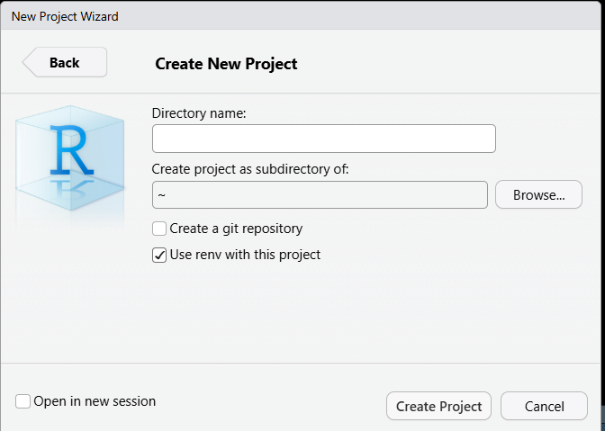
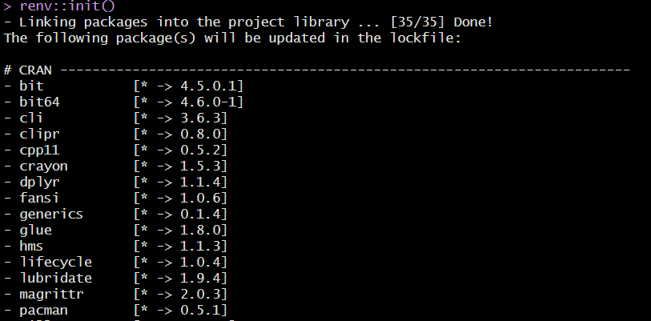
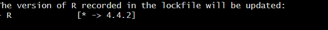
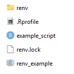
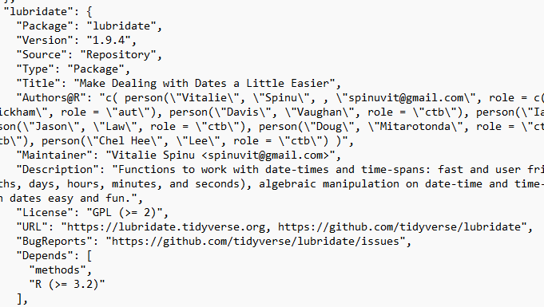
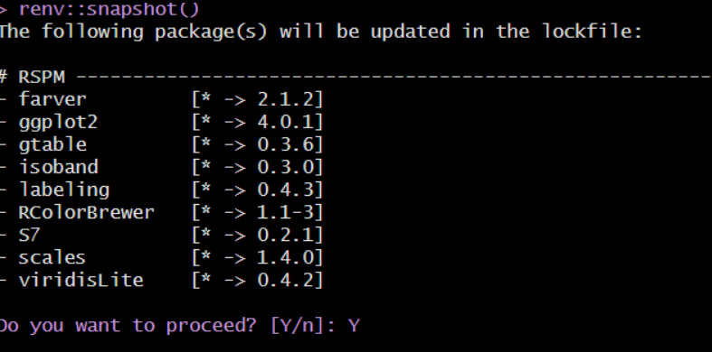

## renv

The renv package is used to create reproducible environments for R projects. This is especially important when sharing code, so that you can ensure your code will run the same for someone else, or if you need to transport code to a new computer or platform. Using renv creates a separate environment for each project, so that you don't have to worry about package version conflicts or inconsistency, and so that you can track the packages and package version being used in your project.

The renv workflow is:

1.  Install renv: install.packages("renv")

2.  Navigate to your project directory and run renv::init() to create a project-local environment with a private R library. There is also an option when creating a new project to use renv.

3.  Work as normal, installing and removing R packages as needed

4.  Run renv::snapshot() to save the state of the project library to the renv.lock lockfile. After making additional updates, run this again to save the state.

5.  To identify and remove packages that are no longer being used run renv::clean()

6.  Commit the renv.lock file in your version control system (git). Include renv/library/ in your .gitignore file to avoid committing the local package installations themselves.

### Using renv with a new project

select 'use renv with this project' when creating a new project

{width="458"}

### Using renv in an existing project

Within your existing project run renv::init() - this will search through all the R scripts in your project and find all the package being used, then create a snapshot of those packages and save them in a new renv library path.

{width="546"}

{width="499"}

This will also create an renv.lock file and a renv library folder:

The renv.lock file stores info on the R version and all packages and versions, for example:

{width="520"}

The renv folder will include the library with the packages being used, a .gitignore file that includes /library so that these files don't get committed, and an activate R file, which will activate the renv every time the project is opened from .Rproj.

### Using renv

##### Adding Packages

When installing new packages you can either install packages as normal with install.packages('package_name") or use renv::install("package_name"). Then save this update to your renv by running renv::snapshot(). This will overwrite the lock file with the packages you added, and you can push this to github so that others have this update as well.

{width="556"}

If there are issues when adding a package you can run renv::restore() to revert the lockfile back to the previous state.

##### Loading renv

When you or a collaborator clone a project with renv it should include the .Rproj file and renv.lock file. When loading renv from the project you can first open the .Rproj file, which will utilize the renv. Then run renv::restore() to configure the environment using the lockfile.
